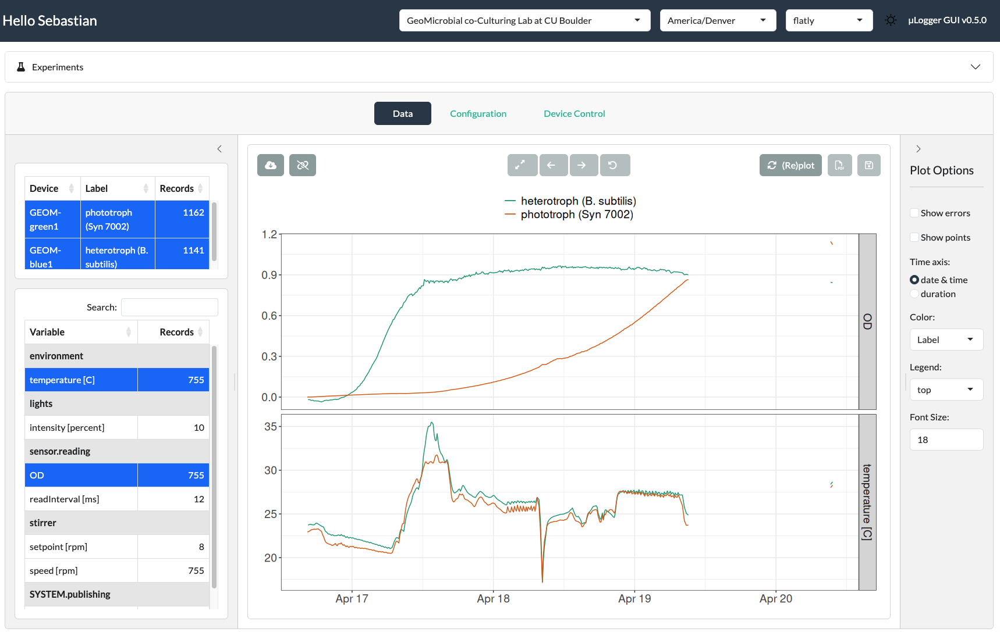

# micrologger

`micrologger` is a web-based graphical user interface for working with GEOM
µLoggers in the lab. From your browser you can organize measurements into
**experiments**, **link µLogger devices** to them, **record and visualize** their
time-series data, and **control the devices** directly — all backed by a shared
group database.

It builds on [sddsParticle](https://github.com/KopfLab/sddsParticle) for the
device discovery and control.

## Documentation

A full, illustrated guide to every part of the interface lives in the
**[project wiki](https://github.com/KopfLab/micrologger/wiki)**.

